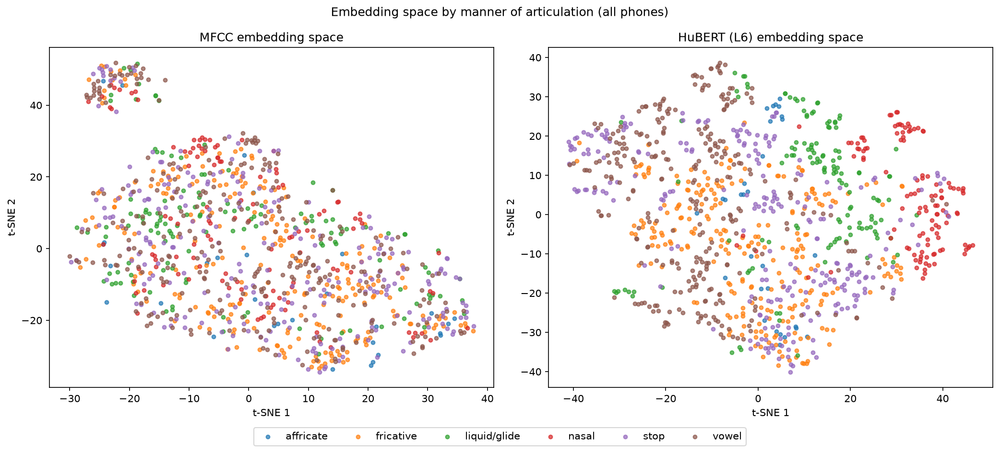
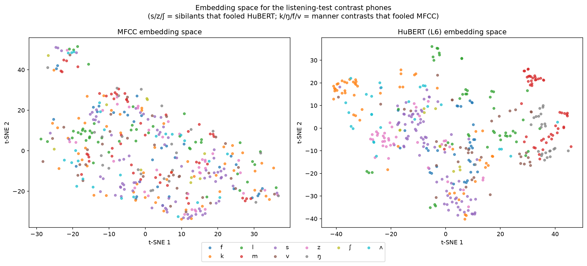

# perceptual-audio-similarity

Does ranking audio similarity by perceptual (learned-embedding) metrics agree with human
perceptual judgment better than signal-level (spectral) metrics? Tested on the Perceptimatic
ABX phone-discrimination benchmark.

**Full writeup: [`report/REPORT.md`](report/REPORT.md)**

## Results at a glance

| Metric | ABX accuracy | Pearson r (vs. human) | Pseudo-R² (probit) |
|---|---|---|---|
| Log-mel | 0.671 | 0.267 | 0.013 |
| **MFCC** | **0.772** | **0.356** | **0.016** |
| wav2vec2 (L6) | 0.748 | 0.272 | 0.012 |
| WavLM (L6) | 0.901 | 0.599 | 0.039 |
| **HuBERT (L6)** | **0.906** | **0.602** | **0.043** |
| MFCC + HuBERT, weighted combo | 0.916 | 0.622 | 0.047 |

wav2vec2 never beats the simple signal-level MFCC baseline; HuBERT and WavLM decisively do,
roughly tripling the probit pseudo-R². The two best metrics also fail on systematically
different, linguistically interpretable classes of phonetic contrast (see below and the full
report) — MFCC on coarse manner-of-articulation confusions (nasal vs. fricative, stop vs.
fricative), HuBERT on fine within-manner contrasts (voicing, place of sibilants).

### Embedding space, by phonetic manner class



MFCC (left) and HuBERT layer 6 (right), both projected to 2D via PCA → t-SNE from the same raw
audio, colored by manner of articulation (vowel, stop, fricative, nasal, liquid/glide,
affricate).

### Embedding space, for the specific contrasts found by listening



Just the phones involved in the head-to-head listening comparison: sibilants (s/z/ʃ) that
fooled HuBERT, and manner contrasts (k/ŋ/f/v) that fooled MFCC.

## Setup

```bash
pip install librosa soundfile scipy statsmodels scikit-learn matplotlib
pip install torch transformers   # only needed for the perceptual (wav2vec2/HuBERT/WavLM) metrics
```

## Getting the data

This repo does not include the ZeroSpeech 2017 dataset or its derived CSVs -- they aren't ours
to redistribute, and the full test set is several GB. Get them via the ZeroSpeech toolbox:

```bash
pip install zerospeech-benchmarks   # or however your ZeroSpeech toolbox is installed
zrc datasets:pull zrc2017-test-dataset
```

That gives you `<zrc_root>/english/1s/*.wav` (and `10s/`, `120s/`), which every script below
points at via `--zrc-root`.

You'll also need three CSVs derived from that dataset, placed in the repo root (or pointed to
via `--triplets-csv` / `--alignment-csv` / `--human-csv`):

- `all_triplets.csv` -- the ABX triplet definitions
- `all_aligned_clean_english.csv` -- phone alignments (index -> file, onset, offset, phone, speaker)
- `human_and_models.csv` -- per-listener human judgments plus MFCC/DP baseline deltas

These ship alongside the Perceptimatic benchmark release; if you don't already have them, they
come from the same ZeroSpeech Perceptimatic distribution as the dataset above.

## Scripts, in the order you'd normally run them

1. **`perceptimatic_loader.py`** -- the data module. `build_triplets(...)` resolves each
   triplet's A/B/X to real audio, cut and resampled to 16 kHz mono. Verified: 2,214 English
   triplets, 983 distinct wavs. Run directly (`python perceptimatic_loader.py`) for a
   self-check against the CSVs alone, no audio needed.

2. **`audio_metrics.py`** -- the metrics themselves, all behind one interface,
   `distance(clip_a, clip_b) -> float`:
   - `MFCCDistance`, `LogMelDistance` -- signal-level baselines.
   - `EmbeddingDistance` -- wav2vec2 / HuBERT / WavLM, any layer, DTW or mean-pooled, cosine or
     Euclidean.
   Run directly (`python audio_metrics.py`) for a synthetic sanity check (no real audio needed).

3. **`evaluate_metrics.py`** -- runs a metric (or a layer sweep of one) over all triplets and
   reports ABX accuracy, correlation with human scores, and probit pseudo-R². Caches per-metric
   deltas to `metric_cache/` so reruns don't recompute.
   ```bash
   python evaluate_metrics.py --zrc-root <path> --metrics mfcc logmel
   python evaluate_metrics.py --zrc-root <path> --metrics hubert --layers 4 5 6 7
   ```

4. **`export_triplet_audio.py`** -- pulls real audio for specific triplets to listen to: the
   easiest/hardest for humans, a metric's confident errors, or head-to-head disagreements
   between two metrics.
   ```bash
   python export_triplet_audio.py --zrc-root <path> --mode compare \
       --deltas-cache-a metric_cache/mfcc_<hash>_deltas.json --name-a mfcc \
       --deltas-cache-b metric_cache/hubert_L6_<hash>_deltas.json --name-b hubert_L6 \
       --focus b_wins --n 10
   ```

5. **`combine_metrics.py`** -- combines two or more metrics' cached deltas (scale-normalized,
   weighted average) and reports the same accuracy/correlation/pseudo-R² table for the
   combination alongside each metric alone. No audio or GPU needed -- works off the cache files
   from step 3.
   ```bash
   python combine_metrics.py --deltas-cache mfcc.json mfcc 1.0 --deltas-cache hubert.json hubert_L6 3.0
   ```

6. **`visualize_embedding_space.py`** -- projects the MFCC and HuBERT embedding spaces to 2D
   (PCA -> t-SNE) and plots them colored by phonetic manner class, saved to `report/figures/`.
   ```bash
   python visualize_embedding_space.py --zrc-root <path> --out-dir report/figures
   ```

## Repo layout

```
.
├── perceptimatic_loader.py
├── audio_metrics.py
├── evaluate_metrics.py
├── export_triplet_audio.py
├── combine_metrics.py
├── visualize_embedding_space.py
├── report/
│   ├── REPORT.md
│   └── figures/
│       ├── embedding_space_manner.png
│       └── embedding_space_contrasts.png
├── .gitignore
└── README.md          (this file)
```

`metric_cache/`, `listen_clips*/`, and the raw dataset are all gitignored -- reproducible by
rerunning the scripts above, not checked in.
